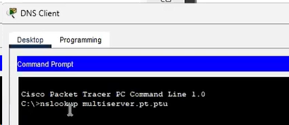

![ref1]**Departamento Académico de Ingeniería**

**C8280 -Comunicación de Datos y Redes**

**Actividad 8: Comunicaciones de TCP y UDP**

**Objetivos**

**Parte 1: Generar tráfico de red en el modo de simulación**

**Parte 2: Examinar la funcionalidad de los protocolos TCP y UDP**
# ` `**Aspectos básicos**
Esta actividad de simulación está destinada a proporcionar una base para comprender TCP y UDP en detalle. El modo de simulación Packet Tracer le proporciona la capacidad de ver el estado de diferentes PDU a medida que viajan a través de la red.

El modo de simulación de Packet Tracer te permite ver cada uno de los protocolos y las PDU asociadas. Los pasos descritos a continuación lo guían a través del proceso de solicitud de servicios de red utilizando diversas aplicaciones que están disponibles en una PC cliente. Explorarás la funcionalidad de los protocolos TCP y UDP, la multiplexación y la función de los números de puerto para determinar qué aplicación local solicitó los datos o los envía.

**Instrucciones**
# **1 .Genera tráfico de red en modo de simulación y vea multiplexación**
**Genera tráfico para completar las tablas del protocolo de resolución de direcciones**

**(ARP)**

Realiza la siguiente tarea para reducir la cantidad de tráfico de red que se ve en la simulación.

1. Haz clic en **MultiServer** y luego haz click en **Desktop** tab > **Command Prompt**.

   

1. Ingresa el comando **ping -n 1 192.168.1.255** . Está haciendo ping a la dirección broadcast de la LAN del cliente. La opción de comando enviará sólo una solicitud de ping en lugar de las cuatro habituales. Esto tomará unos segundos ya que cada dispositivo en la red responde a la solicitud de ping de MultiServer.

   

1. Cierra la ventana **MultiServer**.

**Genera tráfico web (HTTP)**

1. Cambia a modo de simulación.

   

1. Haz clic en **Cliente HTTP** y abre el **Explorador Web** desde el escritorio.

   

1. En el campo URL, introduce **192.168.1.254** y haz clic en **Go** (Ir). Los sobres (PDU) aparecerán en la ventana de topología.

   

1. Minimiza, pero no cierres, la ventana de configuración de **HTTP Client**.

**Genera tráfico FTP.**

1. Haz clic en **FTP Client** y abra el **Command Prompt** desde el escritorio

   

1. Introduce el comando **ftp 192.168.1.254**. Las PDU aparecerán en la ventana de simulación.

   

1. Minimiza, pero no cierres, la ventana de configuración de **FTP Client**.

**Genera tráfico DNS.**

1. Haz clic en DNS Client y abra el **Command Prompt**.

   

1. Introduce el comando **nslookup multiserver.pt.ptu**. Aparecerá una PDU en la ventana de simulación.

   

1. Minimiza, pero no cierre, la ventana de configuración de **DNS Client**.

   

**Genera tráfico de correo electrónico.**

1. Haz clic en **E-Mail Client** y abre la herramienta **E Mail** desde el escritorio.

   

1. Haz clic en **Compose** (Redactar) y escribe la siguiente información:
   1) **To:** user@multiserver.pt.ptu
   1) **Subject:** Personalizar la línea de asunto
   1) **E-Mail Body:** personalizar el correo electrónico

1. Haz clic en **Send** (Enviar).
1. Minimiza, pero no cierres, la ventana de configuración de **E-Mail Client**.

   

**Verifica que se haya generado tráfico y que esté preparado para la simulación.**

Ahora debería haber entradas de PDU en el panel de simulación para cada uno de los equipos cliente.

**Examina la multiplexación a medida que el tráfico cruza la red.**

Ahora utilizarás el **botón Capturar/Reenviar** del Panel de Simulación para observar los diferentes protocolos que viajan por la red.

**Nota**: El botón Capture/Forward ' **>|** ' es una flecha pequeña que apunta a la derecha con una barra vertical al lado.

1. Haz clic una vez en **Capture/Forward**. Todas las PDU se transfieren al switch.

   

1. Haz clic en **Capturar/Reenviar** seis veces y observe las PDU de los diferentes hosts mientras viajan por la red. Observe que solo una PDU puede cruzar un cable en cada dirección en un momento determinado.

   

   Preguntas:

   ¿Cómo se llama esto?

   Se llama conversación multiplexación

   Aparece una variedad de PDU en la lista de eventos en el Panel de simulación. ¿Cuál es el significado de los diferentes colores?

   Se representa de diferentes colores 
# **2. Examinar la funcionalidad de los protocolos TCP y UDP**
**Examinar el tráfico HTTP cuando los clientes se comunican con el servidor.**

5. Haz clic en **Reset Simulation (Restablecer simulación)**.
5. Filtrar el tráfico que se muestra actualmente sólo a las PDU **HTTP** y **TCP**. Para filtrar el tráfico que se muestra actualmente:
   1) Haz clic en **Edit Filters** y alterna el botón **Show All/None** .
   1) Selecciona **HTTP** y **TCP**. Haz clic en la «x» roja en la esquina superior derecha del cuadro Editar filtros para cerrarla. Los eventos visibles ahora deberían mostrar solo las

      PDU **HTTP** y **TCP** .

      

3. . Abre el navegador en HTTP Client e ingresa **192.168.1.254** en el campo URL. Haz clic en **Ir**

para conectarse al servidor a través de HTTP. Minimiza HTTP Client window.

3. Haz clic en **Capturar/Reenviar** hasta que aparezca una PDU para HTTP. Tenga en cuenta

que el color de la envolvente de la ventana de topología coincide con el código de color de la PDU HTTP del Panel de simulación.

Pregunta:

¿Por qué tardó tanto en aparecer la PDU HTTP?

Primero debe establecer una conexión entre servidor para comenzar el trafico.

e. Haz clic en el sobre de la PDU para mostrar los detalles de la PDU. Haz clic en**Outbound PDU Details** y desplácese hacia abajo hasta la segunda sección.

   

Preguntas:

¿Cómo se rotula la sección?

`               `Se rotula en el TCP

¿Se consideran confiables estas comunicaciones?

Si, TCP protocolo confiable

***Escriba sus respuestas aquí.***

Registra los valores de **SRC PORT** (PUERTO DE ORIGEN), **DEST PORT** (PUERTO DE DESTINO), **SEQUENCE NUM** (NÚMERO DE SECUENCIA) y **ACK NUM** (NÚMERO DE RECONOCIMIENTO).

Mira el valor en el campo Indicadores, que se encuentra junto al campo Ventana. Los valores ala derecha de la «b» representan los indicadores TCP que se establecen para esta etapa de la conversación de datos. Cada uno de los seis lugares corresponde a una bandera. La presencia de un «1» en cualquier lugar indica que el indicador está establecido. Se puede configurar más de una bandera a la vez. Los valores de las banderas se muestran a continuación.

|Lugar de la bandera|**6**|**5**|**4**|**3**|**2**|**1**|
| :- | :-: | :-: | :-: | :-: | :-: | :-: |
|Valor|URG|ACK|PSH|RST|SYN|FIN|

Pregunta:

¿Qué indicadores TCP se establecen en esta PDU?

ACK y PSH

Cierra la PDU y Haz clic en **Capture/Forward** hasta que una PDU con una marca de verificación regrese al **HTTP Client**.

Cierra el sobre de PDU y seleccione **Inbound PDU Details**. ¿En qué cambiaron los números de puerto y de secuencia? 

Los puertos de destino y origen cambiaron, asimismo, se cambió el SYN y ACK

Haz clic en la PDU **HTTP que HTTP Client** ha preparado para enviar a **MultiServer.** Este es el comienzo de la comunicación HTTP. Haz clic en este segundo sobre de PDU y seleccione **Outbound PDU Details** (Detalles de PDU saliente).

Pregunta:

¿Qué información aparece ahora en la sección TCP? ¿En qué se diferencian los números de puerto y de secuencia con respecto a las dos PDU anteriores?

Los puertos de destino y origen cambiaron y los indicadores son PSH y ACK.

Restablece la simulación.

**Examinar el tráfico FTP cuando los clientes se comunican con el servidor.**

1. Abre el símbolo del sistema en el escritorio del cliente FTP. Inicie una conexión FTP ingresando **ftp 192.168.1.254**.
1. En el Panel de simulación, cambia **Edit Filters** para mostrar solo **FTP** y **TCP**.
1. Haz clic en **Capture/Forward**. Haz clic en el segundo sobre PDU para abrirlo.Haz clic en la pestaña **Outbound PDU Details** y desplácese hacia abajo hasta la sección TCP.

   Pregunta:

   ¿Se consideran confiables estas comunicaciones?

   Si se consideran fiables.

1. Registra los valores de **SRC PORT** (PUERTO DE ORIGEN), **DEST PORT** (PUERTO DE DESTINO), **SEQUENCE NUM** (NÚMERO DE SECUENCIA) y **ACK NUM** (NÚMERO DE RECONOCIMIENTO).

   Pregunta:

   ¿Cuál es el valor en el campo de bandera?

   `	`1025,21,0,0

1. Cierra la PDU y haz clic en **Capture/Forward** hasta que una PDU vuelva a **FTP Client** con una marca de verificación.
1. Cierra el sobre de PDU y seleccione **Inbound PDU Details**.

   Pregunta:

   ¿En qué cambiaron los números de puerto y de secuencia?

   Los puertos cambiaron de origen y destino cambiaron de posición 

1. Haz clic en la ficha de **detalles de la PDU saliente**.

   Pregunta:

   ¿En qué se diferencian los números de puerto y secuencia de los resultados anteriores?

1. Cierra la PDU y haz clic en **Capture/Forward** hasta que una segunda PDU vuelva a **FTP Client**. La PDU es de un color diferente.
1. Abre la PDU y selecciona **Inbound PDU Details**. Desplázate hasta después de la sección TCP.

   Pregunta:

   ¿Cuál es el mensaje del servidor?

   “Bienvenido al servidor FTP PT”

   Los puertos de destino y origen cambiaron tanto el numero de secuencia 

1. Haz clic en Reset Simulation (Restablecer simulación).

**Examina el tráfico DNS cuando los clientes se comunican con el servidor.**

1. Repita los pasos de la Parte 1 para crear tráfico DNS.

   

1. En el panel de simulación, modifique las opciones de **Edit Filters** para que solo se muestren **DNS** y **UDP**

   

1. Haz clic en el sobre de PDU para abrirlo.
1. Mire los detalles del modelo OSI para la PDU saliente.

   Pregunta:

   

   ¿Qué es el protocolo de capa 4?

   UDP y el número de puerto.

   ¿Se consideran confiables estas comunicaciones?

   No se consideran confiable 

1. ***No*** Abra la ficha Detalles de PDU saliente y busque la sección UDP de los formatos de PDU.

   Registre los valores de **SRC PORT** y **DEST PORT** .

   

   Pregunta:

   ¿Por qué no hay números de secuencia y reconocimiento?

   No necesita establecer una conexión confiable

1. Cierre la **PDU** y haz clic en **Capture/Forward** hasta que una PDU con una marca de verificación regrese al **DNS Client**.
1. Cierra el sobre de PDU y seleccione **Inbound PDU Details**.

   Pregunta:

   ¿En qué cambiaron los números de puerto y de secuencia?

   Los puertos de origen y destino se invirtieron 

   ¿Cómo se llama la última sección de la **PDU**? ¿Cuál es la dirección IP para el nombre **multiserver.pt.ptu**?

   DNS 192.1681.254

1. Haz clic en Reset Simulation (Restablecer simulación).

**Examina el tráfico de correo electrónico cuando los clientes se comunican con el servidor.**

1. Repite los pasos de la Parte 1 para enviar un correo electrónico a [**user@multiserver.pt.ptu**](mailto:user@multiserver.pt.ptu).

1. En el panel de simulación, modifique las opciones de **Edit Filters** para que solo se muestren **POP3, SMTP** y **TCP**.

   

1. Haz clic en el primer sobre de la PDU para abrirlo.

1. Haz clic en la pestaña **Outbound PDU Details** y desplácese hacia abajo hasta la última sección.

Preguntas:

¿Qué protocolo de la capa de transporte utiliza el tráfico de correo electrónico? ¿Se consideran confiables estas comunicaciones?

El protocolo TPC, si

1. Registra los valores de **SRC PORT** (PUERTO DE ORIGEN), **DEST PORT** (PUERTO DE DESTINO), **SEQUENCE NUM** (NÚMERO DE SECUENCIA) y **ACK NUM** (NÚMERO DE RECONOCIMIENTO). 

   

   ¿Cuál es el valor del campo de bandera?

   1025, 25.0,0. SYN

1. Cierra la **PDU** y haz clic en **Capture/Forward** hasta que una PDU regrese al **E-Mail Client** con una marca de verificación.
1. Haz clic en el sobre TCP PDU y seleccione **Inbound PDU Details**.

Pregunta:

¿En qué cambiaron los números de puerto y de secuencia?

SYN, ACK los puertos se invirtieron de origen y destino

1. Haz clic en la ficha de **detalles de la PDU saliente**. ¿En qué se diferencian los números de puerto y de secuencia con respecto a los dos resultados anteriores?
1. Hay una segunda **PDU** de un color diferente que **E-Mail Client** hha preparado para enviar a **MultiServer**. Este es el comienzo de la comunicación de correo electrónico. Haz clic en este segundo sobre de PDU y seleccione **Outbound PDU Details**.

Preguntas:

¿En qué se diferencian los números de puerto y de secuencia con respecto a las dos **PDU** anteriores?

PSH. ACK están invertidos el puerto de origen y destino

¿Qué protocolo de correo electrónico se relaciona con el puerto TCP 25? ¿Qué protocolo se relaciona con el puerto TCP 110?

SMTP.POP3

*Fin del documento*
Comunicación de Datos y Redes

[ref1]: Aspose.Words.be6c0252-7dd2-4ea3-a5f7-1470f44b538f.001.png
